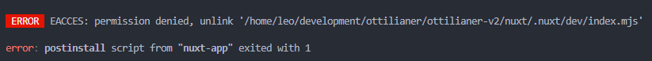

## Installation

> **Note:** This guide assumes that you're using a Unix-based operating system. If you're using Windows, you could adjust the commands accordingly but I would recommend using a Unix-based operating system or at least the Windows Subsystem for Linux (WSL).

Please make sure you have installed the following software:

- [Bun Runtime](https://bun.sh)
- [Node.js](https://nodejs.org)
- [Docker](https://www.docker.com)
- [Docker Compose](https://docs.docker.com/compose/)

### Clone the Repository

```sh
git clone git@github.com:Ottilianer/ottilianer-v2.git
```

### Change the Directory

```sh
cd ottilianer-v2
```

### Install the Frontend

```sh
cd frontend
bun install
```

### Starting the Containers

```sh
docker compose -f docker-compose.dev.yml up
```

## Permission Denied Error



It's possible that you receive a error like shown above when installing new npm modules. This error occurs, because Docker manages the environment, which means, that the `nuxt/.nuxt` folder belongs to the root user (You don't have to understand this). All you have to know is that you should run

```sh
sudo chmod -R 777 .
```

in the workspace **after stopping the containers** to fix the error temporarily.

## Any Questions?

If you have any questions, please contact me (Leo Gall) via Teams (<leo.gall@rmg-ottilien.de>), E-Mail (<gall.dev@proton.me>) or by phone (0170 591 5654).
